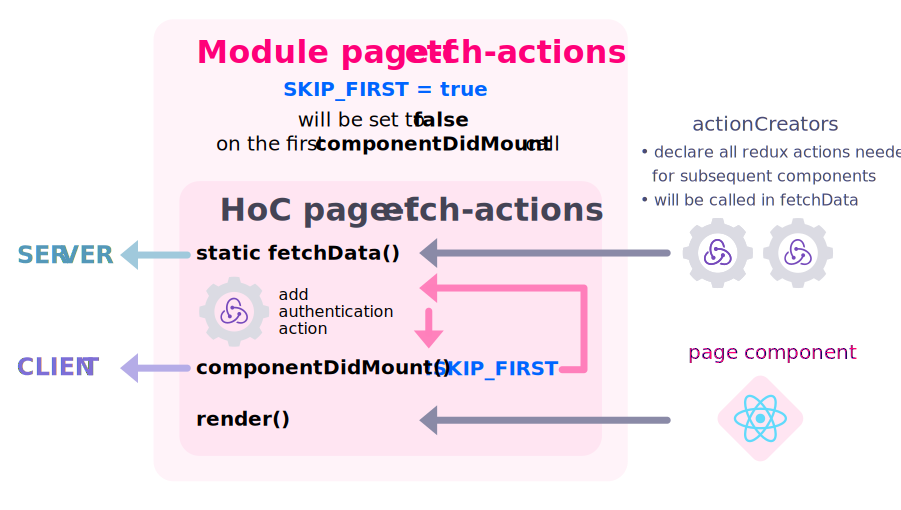
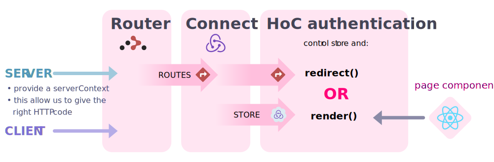
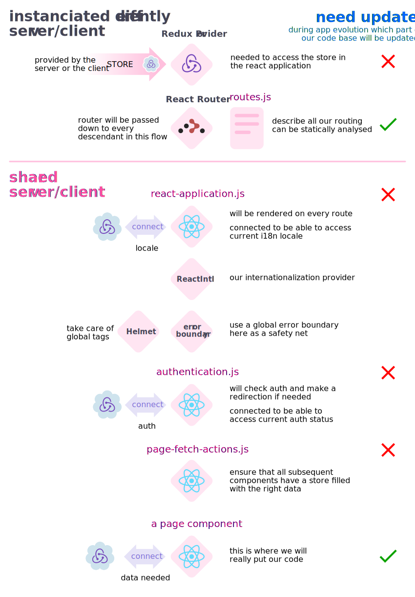

# Isomorphic application with React/Redux

So I wanted to build an isomorphic/universal web-application.  
This will be a long document about the *how* and the *why*.
The web-app was greatly influenced by this [Viktor Turskyi's post](http://blog.koorchik.com/isomorphic-react/).

Unlike this article, I won't produce here any code example.
I will try to focus on how different piece of code put together will solve building an universal applications problems.

It's my first take on this kind of application, so I'm sure there are many flaws & rooms for improvement.  
But hey, we need a start in order to advance 🏃‍♀️


<!-- START doctoc generated TOC please keep comment here to allow auto update -->
<!-- DON'T EDIT THIS SECTION, INSTEAD RE-RUN doctoc TO UPDATE -->


- [about the API](#about-the-api)
- [prerequisite](#prerequisite)
- [supported features & Tech](#supported-features--tech)
  - [reasons & Features](#reasons--features)
  - [tech](#tech)
- [code mutualization](#code-mutualization)
- [building the applications](#building-the-applications)
  - [server](#server)
  - [client](#client)
  - [sharing the configuration](#sharing-the-configuration)
    - [server](#server-1)
    - [client](#client-1)
    - [during test](#during-test)
    - [configuration summary](#configuration-summary)
- [purpose of server rendering](#purpose-of-server-rendering)
- [application flow summary](#application-flow-summary)
- [routing with React-Router & Redux](#routing-with-react-router--redux)
  - [what is React-router](#what-is-react-router)
  - [interfacing with the server](#interfacing-with-the-server)
  - [get Redux Actions from components](#get-redux-actions-from-components)
  - [limitations](#limitations)
  - [server flow summary](#server-flow-summary)
- [authentication](#authentication)
  - [authentication HoC flow](#authentication-hoc-flow)
- [i18N with React-Intel](#i18n-with-react-intel)
- [adding React-Helmet](#adding-react-helmet)
- [The full chain of components](#the-full-chain-of-components)

<!-- END doctoc generated TOC please keep comment here to allow auto update -->

## about the API

The web-application will interact with an API (`packages/api`) which will not be detailed here.
The only thing we need to know about the API is that:

- It's a REST like API (uses only GET & POST)
- Communicate with JSON
- Authenticate with a JSON Web Token (JWT) 

this document will __only focus__ on the `packages/web-app` folder

__Why no GraphQL?__

[GraphQL](http://graphql.org/) seems a nice tech, but I simply didn't have time to dig into it.

## prerequisite

You should have some notions with:

- [React](https://reactjs.org/) 
  - what is a [Component](https://reactjs.org/docs/components-and-props.html)
  - what is a [High-Order Component (HoC)](https://reactjs.org/docs/components-and-props.html)
- [Redux](https://redux.js.org/) 
  - what is a [store](https://redux.js.org/basics/store)
  - what is an [action](https://redux.js.org/basics/actions)
  - what is a [reducer](https://redux.js.org/basics/reducers)
  - how to use [react-redux](https://redux.js.org/basics/usage-with-react) to connect our React components to the store
- Some javascript tooling:
  - [Webpack](https://webpack.js.org/) for bundling our application
  - [BabelJs](http://babeljs.io/) for converting [React jsx](https://reactjs.org/docs/introducing-jsx.html) code to plain javascript

## supported features & Tech

### reasons & features

I make this universal application to learn more about React.

- I wanted to know how things work, so I didn't use any frameworks like [next.js](https://github.com/zeit/next.js/) or [create-react-app](https://github.com/facebook/create-react-app) that will build things for me that I don't truly understand.
- I also wanted to make an exhaustive application: not a TODO app example.
  There are plenty of those already, It's good to begin with but whenever you want to build something more complex, you'll have a hard time to stitch the piece togeter.

In order to make it the most *real life* example this web-app will:

- __mutualise all the code__ we can
- support __authentication__
- support __Internationalization__ (i18n)
- be __testable__ (even if there isn't as much tests that I wanted 😨)
- should __work without JS__ in the browser
  - I believe in progressive enhancement 
  - while developing, this allow to make API POST request without taking care about the redux actions.  
    Those can be created in a second time.
  - I will use `browser cookie` to store the JWT.  
    It's the only way to store informations on the browser without relying on Javascript.  
    Sadly a browser without JS & cookie is doomed 😔

### tech

__React library__, among others, is a great way to __ensure__ that __our applications is perfectly in sync with our__  application __state__.  
So we can rely on it to __always render the proper thing__ depending on the route/user actions/API queries.  
Thus, we will omit this part from this document (*i.e.* considering that changing the route/state will always render the right HTML)

Here are all the main modules used: 

- __views__ 
  - [React 16.3](https://reactjs.org/)
- __routing__ 
  - [React router 4](https://reacttraining.com/react-router/) 
  - [react-router-config 1](https://www.npmjs.com/package/react-router-config) for the universal support
- __application state__ 
  - [redux 4](https://redux.js.org/)
  - [redux thunk](https://www.npmjs.com/package/redux-thunk) for a better handling of asynchronous actions
  - [react redux](https://github.com/reactjs/react-redux) for a better integration with React
- __server__ 
  - [Koa 2](http://koajs.com/) (see [this post](https://hiswe.github.io/2018/07-from-express-to-koa/) about why I chose Koa)

## code mutualization

As for the version 1.1.0:  

| front  | server  | shared front/client |
|   ---: |    ---: |                ---: |
| 36 loc | 279 loc | 6476 loc            |
| 1%     | 4%      | 95%                 |


I don't expect this repartition to change much with futur versions.  
It should be: 

- more & more code into the shared folder
- some small additions in server code (mainly for proxying POST fallback)

## files structure

I tried to avoid nesting folders too deeply.  
I used [lerna](https://lernajs.io/) to have a clear separation between our API & the web-app.  
I may move to [yarn workspaces](https://yarnpkg.com/blog/2017/08/02/introducing-workspaces/) when it will leave its experimental status

Here are the main choices:

- __client__:
  - `root`: a single file to initialize the Redux-store, the router and hydrate our React application
- __server__
  - `root`: initializing our Koa app & the routing 
  - `public`: all our compiled JS/CSS + some assets
- __shared__
  - `root`
    - isomorphic files
    - main HoC (will come to them later)
  - `redux-ducks`: all our Redux related code using the [ducks convention](https://github.com/erikras/ducks-modular-redux)
      This helps keeping all our Redux related code in one file
  - `[…components]`: organized by domain
      The `ui` are mostly presentational components  
      I could have used more external components

## building the applications

Using React with [JSX](https://reactjs.org/docs/introducing-jsx.html) make the code easier to write and to maintain so:

- a building step is required to convert JSX to regular JS
- the most popular solution right now is the couple [Webpack](https://webpack.js.org/)/[Babel](http://babeljs.io/)
  - Webpack in version 4 since a while
    It promises to be simpler, but you will still find yourself to add some plugins/loaders at one point or another
  - as the latest version of Ava use babel 7, I picked it for my build process also.
    At this time (may 2018) it's in `beta 47` 😳 and working perfectly
    I can't thank enough all the people contributing to this project and I really hope that the final release will come soon
- since we have a build step, why not
  - use [ES2015 modules](https://ponyfoo.com/articles/es6-modules-in-depth)
  - import our `scss` files directly in the components. 
    That really __helps separate concerns about what a Component should do and how is it displayed__
    Also it will ma it easy to __keep the styles next to the markup__
- I didn't want any `@babel/register` in my server code because it might have performance cost so:
  __build also the server code with webpack__
  And that will also allow me to replace some files when needed

On a side node [ParcelJs](https://parceljs.org/) seems very promising.  
As I see it, it's still too young (version 1 released on december 2017). 
I'll wait a little bit for more documentation & tutorials , and surely try it on another side projet

### server

- don't want to bundle the `node_modules`: they are already accessible in nodeJS environment 
  → done with [webpack-node-externals](https://www.npmjs.com/package/webpack-node-externals)
- want to always have access of source-map
  → done with the the [webpack banner-plugin](https://webpack.js.org/plugins/banner-plugin/) and the [source-map-support](https://www.npmjs.com/package/source-map-support) module
- ignore `.scss` requires
  → done with [babel-plugin-transform-require-ignore](https://www.npmjs.com/package/babel-plugin-transform-require-ignore)
  __lesson learn: use babel to transform your code before bundling it with webpack__ 

### client

- want to bundle the `node_modules` in a separate file
  → done with [webpack split-chunks-plugin](https://webpack.js.org/plugins/split-chunks-plugin/)
- want to bundle `.scss` in a `.css` separate file
  → done with [webpack extract-text-webpack-plugin](https://www.npmjs.com/package/extract-text-webpack-plugin)
  working in my case but should migrate to [webpack mini-css-extract-plugin](https://www.npmjs.com/package/mini-css-extract-plugin) (here is [why](https://github.com/webpack-contrib/extract-text-webpack-plugin/issues/749#issuecomment-374549467))


### sharing the configuration

I use to manage my server configuration with [rc](https://www.npmjs.com/package/rc).  
I wanted to keep it that way but an isomorphic configuration [comes with some challenge](http://blog.koorchik.com/isomorphic-react/#Isomorphic_configuration).

To keep it versatile, I wanted to pass my configuration down to the client like this:

```
rc → server → client
```

Unlike Viktor Turskyi's solution, I replaced the config import with specific server/client files.
__This prevents mixing ES modules with Node's CommonJS modules syntax__

→ done with 
(normal-module-replacement-plugin)[https://webpack.js.org/plugins/normal-module-replacement-plugin/]

#### server

```js
export { default } from '../server/config'
```

#### client

```js
export default window.__CONFIG__
```

where `window.__CONFIG__` is passed by the server

#### during test

[AVA](https://github.com/avajs/ava) is used for testing.  
By default it uses babel to convert JSX. So I tried to keep it that way so → no Webpack.
This will make it easier to require a single component and test it.

So I just use the use my configuration entry point as the test configuration: no need to replace it with webpack!  
I use the same babel configuration than the server, to prevent including the SCSS 😀

#### configuration summary


## purpose of server rendering

Server rendering seems a good idea for 2 main reason:

- make our __first display quicker__ 
- __support no-JS environment__

For this we need:

1. grab the right components to render (using the [React methods for server rendering](https://reactjs.org/docs/react-dom-server.html))
    a non exiting route means rendering the 404 component
2. make sure that the components have the right datas to begin with.
3. pass everything to the client
4. after that the client will initialize and run as a [single page application](https://en.wikipedia.org/wiki/Single-page_application)

## application flow summary

This is how the app behave from the __first render__ made by the __server__ to the __subsequent client handling__

Here is a little bit of explanation:

- __symbols__
  -  represents a cookie either read from a server request, or from the browser
  -  represents a JWT which will be used for authentication between our web-application and the API
  - arrows between them represent reading/writing from/into the cookie
- __REACT-ROUTER__ will mutualise all our pages routes
  - on the __server__: direct call to the API (either in GET or POST) will be manually proxied
  - this for supporting __no-JS__ environment
  - this is done in the `server/routing-api-backup.js`
- __REDUX__ will maintain our app state
  - I uses the [duck convention](https://github.com/erikras/ducks-modular-redux) to organize the code
  - We will define in some `redux actions` the API calls
- __ISO-FETCH__ is a small wrapper around [isomorphic-fetch](https://www.npmjs.com/package/isomorphic-fetch)
  It will handle any Fetch request to the API
  Keep in mind that:
  - on the __server__: the cookie content will be provided by the server
  - on the __client__: it can read the browser's cookie content by itself
  


## routing with React-Router & Redux

### what is React-router

[React-router](https://reacttraining.com/react-router/) is, I think, the most common routing solution for React.
They have recently updated their library to the version 4.

There is a huge [shift of philosophy](https://reacttraining.com/react-router/core/guides/philosophy) between the previous versions and this one.
They call it *dynamic routing* and it's very different from the classical way.  

### interfacing with the server

To interface nicely with our Koa server, we need something that:

1. is more traditional & plays well with a server routing
2. can be easily shared between the server/client

For that they have made a package named [react-router-config](https://www.npmjs.com/package/react-router-config). 
It's still in beta but is already working as expected.

React Router Config mainly does 3 things: 

- a way to define a __routing configuration__
- a method to __retrieve the component that match the route__
- give a way for the router to __give back informations to the server__ (like not found & redirection) so we can serve the pages with right HTTP code.

### get Redux Actions from components

Like seen before, with react-router-config __it's easy to get which components to render.__

But we need a way to tell our server which datas those components needs.  
We will rely on Redux to maintain a coherent state.

What we __need is redux actions__ that we __dispatch to our store__ and redux will do his job. 

But because it's an universal application:

- on the __server__ we will need the __actions to be called before instantiating our components__ 
    → this is solved by using a [static method](https://developer.mozilla.org/en-US/docs/Web/JavaScript/Reference/Classes/static) on our components
- on the __client__ we will need the __actions to be called in [componentDidMount()](https://reactjs.org/docs/react-component.html#componentdidmount)__
- on __first rendering__ we must __prevent the client to call the componentDidMount() actions__
    Calling them twice won't have a lot of side effects but making the same set of requests is inefficient…

The solution came again from [Viktor Turskyi's post](http://blog.koorchik.com/isomorphic-react/#Data_fetching) about data fetching.

We need to make a [HoC](https://reactjs.org/docs/higher-order-components.html) to take care of this.

It will:

1. take in input a `component` and an array of redux actions (`actionsCreators`)
2. always add the authentication action (needed for the app to ensure the right display)
3. return the `component` in the `render()` passing in any `props`
4. for the __server__: expose a static method named `fetchData` which will `dispatch` any `actions` of the `actionsCreators` array
5. for the __client__: call `fetchData` in `componentDidMount`
6. prevent the first call of `componentDidMount` (with a module variable named `SKIP_FIRST_COMPONENTDIDMOUNT`)



### limitations

The main issue of doing so is that we __need to call all the actions needed for all the children components in the top `page component`__  

It will be nicer if we declared all those actions on the concerned components and find a way to hoist & aggregate them to the page component.

### server flow summary


## authentication

This one is quite easy.  
Authentication is handled by 2 [HoC](https://reactjs.org/docs/components-and-props.html)

1. __public route__ will redirect to private home if connected  
    `authentication-forbidden.js`
2. __private route__ will redirect to login page if not connected 
    `authentication-required.js`

They follow the same pattern:

1. need to be __connected to the redux store__ to check authentication 
    → done with [react-redux](https://redux.js.org/basics/usage-with-react#presentational-and-container-components)
2. need to be __connected to the react router__ to access the redirection
    → done with [react-router-config](https://www.npmjs.com/package/react-router-config)
    On the __server__ we also a procide a `serverContext` object
    (on the documentation they call it [staticContext](https://reacttraining.com/react-router/web/guides/server-rendering) but I find it more obvious with the name that I use)
3. will check `redux store` authentication
    - redirect if needed
      update `serverContext` if rendered on server side
      __this will be used to have the right HTTP status code when serving the application__
    - render component if everything's fine

### authentication HoC flow



## i18N with React-Intel

[React-Intel](https://github.com/yahoo/react-intl/wiki) fits my needs: 
  - formating numbers 
  - formating dates
  - providing translations

The documentation is quite good and the implementation straightforward.

We just need to:

- keep our current locale in the `Redux-Store` so we can change our locale dynamically
- wrap our application with the `<IntlProvider />` component
- define our locals files
- follow the guide to [server rendering](https://github.com/yahoo/react-intl/wiki#locale-data-in-nodejs)

What we can improve:

This simple take is __suitable for a small application__ but may be __hard to maintain on a larger scale__.

- load our `locales files` async
  - right now every locales are bundled
- have a way to extract our keys from the application
  - a very interesting post was written by [Vlad Goran](https://blog.idagio.com/localisation-or-how-i-learned-to-stop-worrying-and-love-babel-plugin-react-intl-8eeb51d80d77) about extracting with [babel-plugin-react-intl](https://github.com/yahoo/babel-plugin-react-intl) but [it doesn't seem to work with babel-7](https://github.com/yahoo/babel-plugin-react-intl/issues/122)

## adding React-Helmet

We still need to provide `<head>` and `<script>` tags.
In order to do so, and to keep most of the code on the shared folder, just use [React-Helmet](https://www.npmjs.com/package/react-helmet)

It will handle for us: 

- the `<html>` tag
- the `<title>` tag
- any `<meta>` and `<stylesheet>`

I didn't put any `<script>` for a reason that I can't remember 😶

Since almost any HTML is handled by React, on the server we don't need to write a lot of things, thus we can use Javascript template strings instead of any template engine
    
## The full chain of components

So from top to bottom this how our components fits together.
The main thing is that our __HoC won't change over time__ so we just have to write our application without worrying about server/client, auth, i18n anymore!


