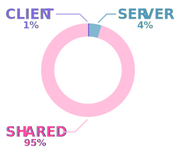
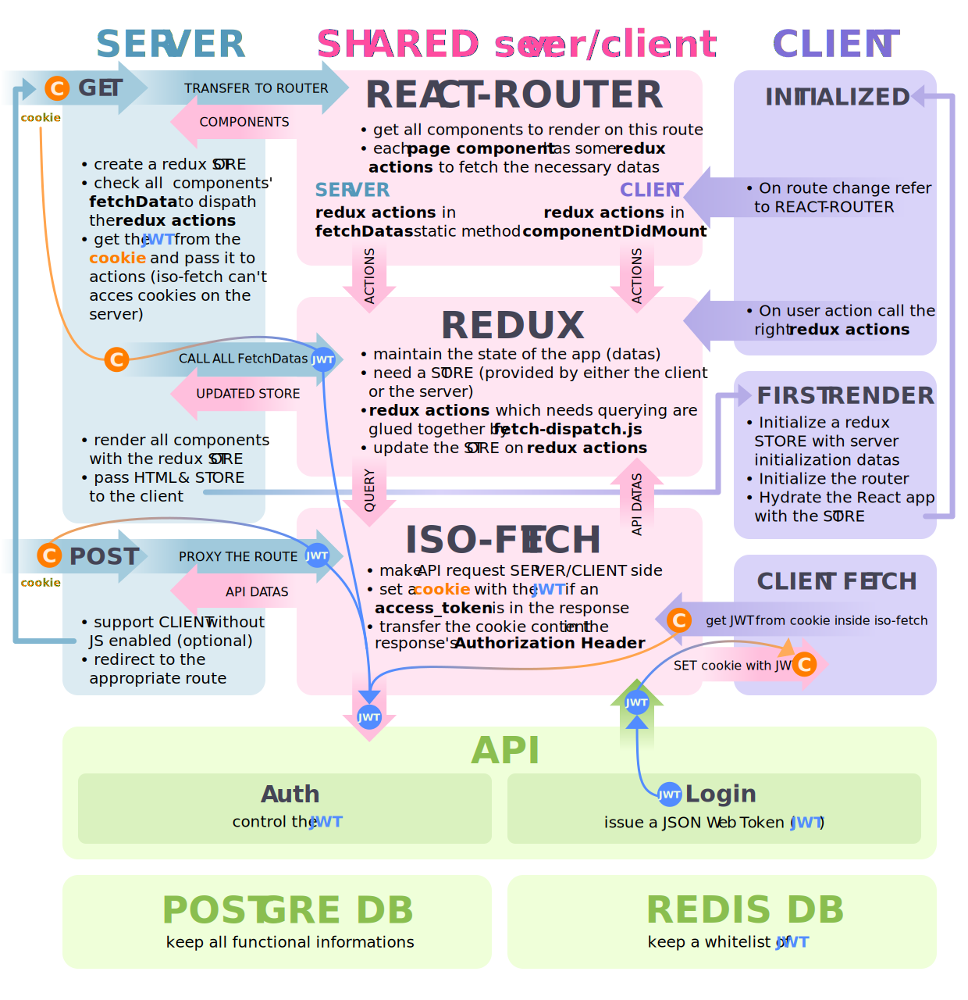

# Isomorphic application with React/Redux

The purpose of this document is to get in the details of this application architecture.
As pointed in the README to have a complete example of how to create I choose NOT to build a TODO application.

<!-- START doctoc generated TOC please keep comment here to allow auto update -->
<!-- DON'T EDIT THIS SECTION, INSTEAD RE-RUN doctoc TO UPDATE -->

- [About the API](#about-the-api)
- [Prerequisite](#prerequisite)
- [Supported features & Tech](#supported-features--tech)
  - [Features](#features)
  - [Tech](#tech)
- [Code mutualization](#code-mutualization)
- [Application flow between server/client](#application-flow-between-serverclient)

<!-- END doctoc generated TOC please keep comment here to allow auto update -->

## About the API

The web-application will interact with an API (`packages/api`) which will not be detailed here.
The only thing we need to know about the API is that:

- It's a REST like API (use only GET & POST)
- Communicate with JSON
- Authenticate with a JSON Web Token (JWT) 

this document will __only focus__ on the `packages/web-app` folder

## Prerequisite

You should have some notions with:

- React 
  - what is a [Component](https://reactjs.org/docs/components-and-props.html)
  - what is a [High-Order Component (HoC)](https://reactjs.org/docs/components-and-props.html)
- Redux 
  - what is a [store](https://redux.js.org/basics/store)
  - what is an [action](https://redux.js.org/basics/actions)
  - what is a [reducer](https://redux.js.org/basics/reducers)

## Supported features & Tech

### Reasons & Features

I make this universal application to learn more about React.

- I wanted to know how things work
- so I didn't want to use any magic bullet like [next.js](https://github.com/zeit/next.js/) or [create-react-app](https://github.com/facebook/create-react-app)
- I also wanted to make an exhaustive application to have a full starting point in one place

In order to make it the most *real life* example this web-app will:

- mutualise all the code we can
- support authentication
- support Internationalization (i18n)
- be testable
- should work even without JS in the browser
  - I like progressive enhancement 
  - while developing, this will allow us to make API POST request without taking care about the redux actions.  
    Those can be handled on a second time.
  - we will need to use `browser cookie` to store the JWT.  
    it's the only way we can store informations on the browser without relying on Javascript.

### Tech

React library, among others, is a great way to ensure that our applications is perfectly in sync with our application states.
So we can rely on it to __always render the proper thing__ depending on the route/user actions/API queries.  
Thus, we will omit this part from this document (*i.e.* changing route/state always render the right HTML)

Here are all the main modules used: 

- *views* – [React 16.3](https://reactjs.org/)
- *router* 
  - [React router 4](https://reacttraining.com/react-router/) 
  - [react-router-config 1](https://www.npmjs.com/package/react-router-config) for the universal support
- *application state* 
  - [redux 4](https://redux.js.org/)
  - [redux thunk](https://www.npmjs.com/package/redux-thunk) for a better handling of asynchronous actions
  - [react redux](https://github.com/reactjs/react-redux) for a better integration with React
- *server* – [Koa 2](http://koajs.com/)

## Code mutualization

As for the version 1.1.0:  

| front  | server  | shared front/client |
|   ---: |    ---: |                ---: |
| 36 loc | 279 loc | 6476 loc            |
| 1%     | 4%      | 95%                 |

I don't expect this repartition to change much with futur versions.  
It should be: 

- more & more code in shared code
- some small additions in server code (mainly for proxying POST fallback)

## Application flow between server/client

This is how the app behave from the __first render__ made by the __server__ to the __subsequent client handling__

Here is a little bit of explanation:

- __symbols__
  -  represents a cookie either read from a server request, or from the browser
  -  represents a JWT which will be used for authentication between our web-application and the API
  - arrows between them represent reading/writing from/into the cookie
- __REACT-ROUTER__ will mutualise all our pages routes in GET
  - when __no JS__ we support GET/POST routes that aren't meant to display a page will be manually proxied to the API 
    this is done in the `server/routing-api-backup.js`
- __REDUX__ will maintain our app state
  - I uses the [duck convention](https://github.com/erikras/ducks-modular-redux) to organize the code
  - We will define in some `redux actions` the API calls
- __ISO-FETCH__ is a small wrapper around [isomorphic-fetch](https://www.npmjs.com/package/isomorphic-fetch)
  - it will handle any Fetch request to the API
  - when running on the client it can read the browser's cookie
  - when running on the server the cookie content will be provided by the server

