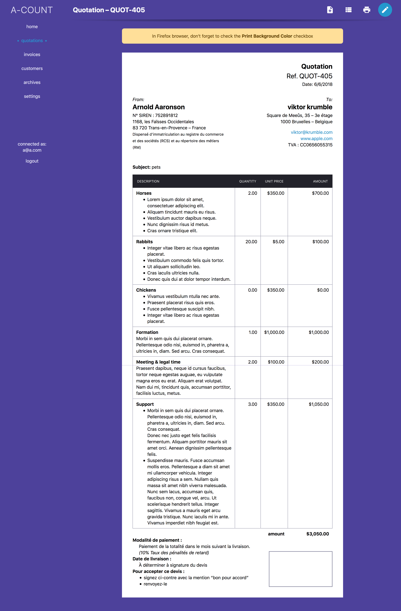

# a-count

simple accounting universal application

<!-- START doctoc generated TOC please keep comment here to allow auto update -->
<!-- DON'T EDIT THIS SECTION, INSTEAD RE-RUN doctoc TO UPDATE -->

- [about](#about)
- [website](#website)
- [developers](#developers)
  - [domain supported](#domain-supported)

<!-- END doctoc generated TOC please keep comment here to allow auto update -->

## about

An accounting app, where you can:

- create an account
- manage customers
- manage quotations/invoices lifetime
- format quotations/invoices with markdown
- print any quotations/invoices from the browser
- select a currency for _presentational purpose only_

## website

[https://a-count.herokuapp.com/](https://a-count.herokuapp.com/)

</img> </img> </img> </img> </img>

## developers

see [README_DEV.md](/README_DEV.md) for building the application

### domain supported

- should work without JS activated on the client
- clear separation of the app & the API (mono-repository)
- authentication
- i18n
